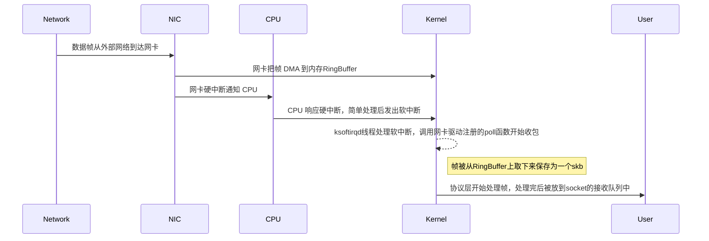

> 基于Linux kernel 6.0

# Linux内核收包总览



# Linux启动

* kernel/softirq.c 创建 ksoftirqd
并不直接以函数调用的方式创建，通过 early_initcall(spawn_ksoftirqd)，将spawn_ksoftirqd加入vmlinux文件的.init段，在程序启动时，即被调用。

* include/linux/init.h 中的 early_initcall(fn)

init.h中也有其他的一些 *_initcall(fn)，early_initcall(fn)在初始化SMP前就被运行，只用于build-in的代码，不能用于modules。

spawn_ksoftirqd 函数被加入vmlinux的.init段后，最终会被do_initcalls()调用。

```
start_kernel # init/main.c
	-> rest_init() # init/main.c
		-> kernel_thread(kernel_init, NULL, CLONE_FS | CLONE_FILES); # init/main.c
			-> kernel_init()
				-> kernel_init_freeable();
					-> do_basic_setup();
						-> do_initcalls();
```

